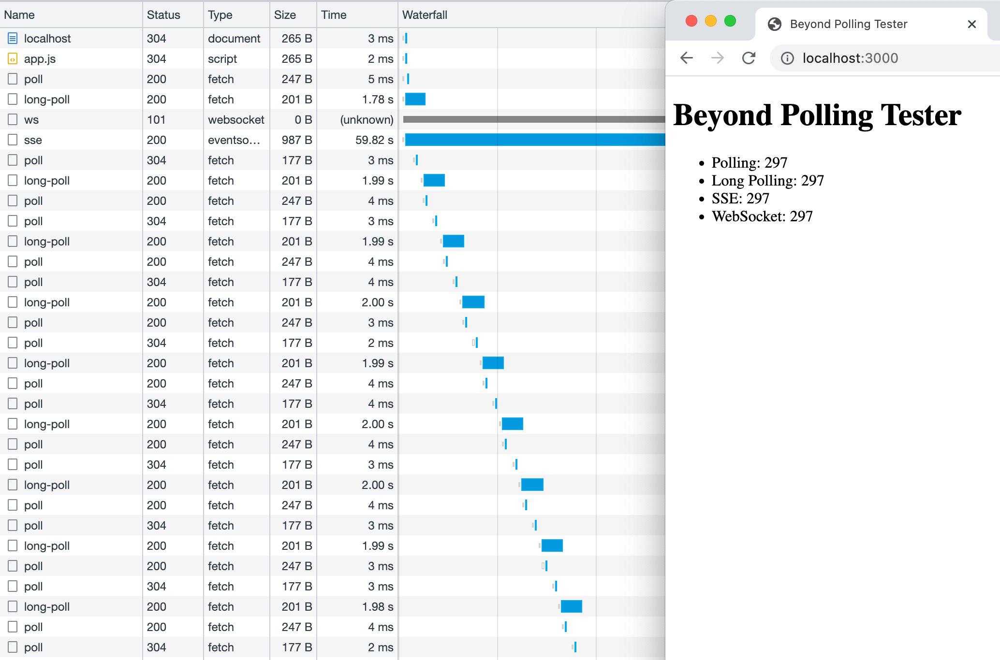

# Beyond Polling

An exploration of techniques used to send data from a backend to a frontend.

This project contains an application server with an incrementing data source that produces
a new value every two seconds. This server exposes endpoints for each approach.

The frontend accesses the data with very basic vanilla JS, updating items in a list with the server’s latest values.

While an incrementing number source is far from a complex production web application, and a `ul` is not quite a full React application, this serves as a proof of concept of the approaches used in streaming web applications.

## Running

1. Ensure Node JS is installed
1. Install dependencies with `npm install`
1. Run the server with `npm start`
1. Open browser to [localhost:3000](http://localhost:3000)

### Check it out

Once the application is running, take a look at the network inspector of your browser to see how each approach behaves over the wire. Pay attention to the number of requests and data transferred.

_Note: Chrome reports websockets as 0 bytes, but each message is actually a handful of bytes very similar to SSE_

## Summary of Approaches

### Polling

- Many round-trip requests
- Requests can be wasteful
- Some updates may be missed between requests
- Updates are received whenever the polling is performed, not immediately

### Long polling

- Many round-trip requests
- Response only when there is an update (or timeout)
- Some updates may be missed between requests
- Updates are received whenever the data is sent from the server

### Server-Sent Events

- Single request for many responses
- Built-in retries on failed connections
- Updates are typically not missed, since the connection stays open
- Updates are received whenever the data is sent from the server
- One direction: server to client

### WebSockets

- Single request (and upgrade) for many responses
- No built-in retries on failed connections
- Updates are typically not missed, since the connection stays open
- Updates are received whenever the data is sent from the server
- Bidirectional: server and client can communicate back and forth
